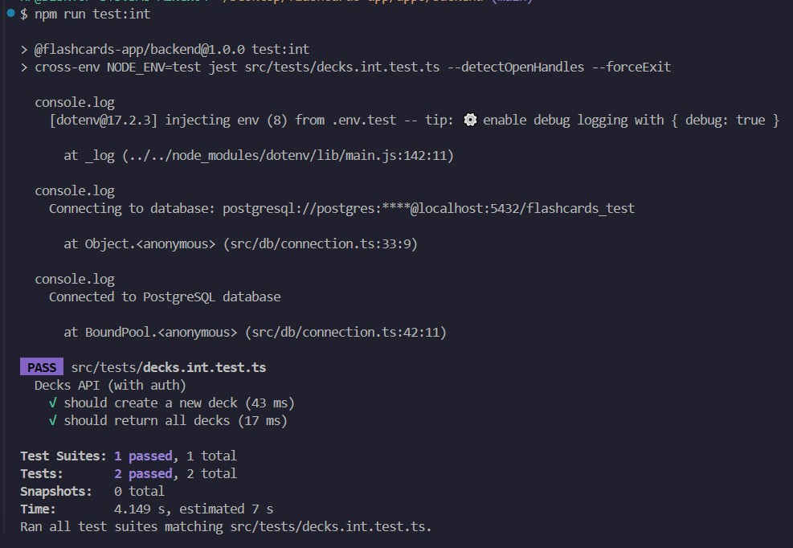
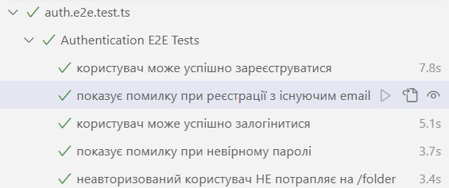
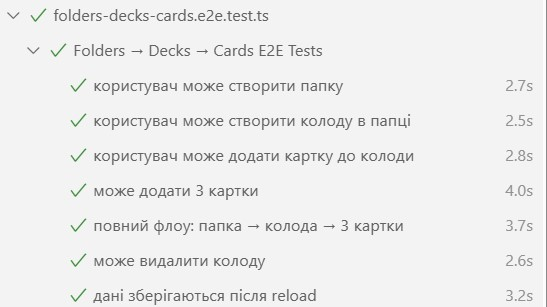
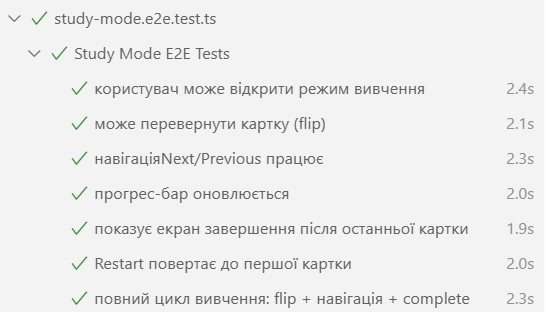
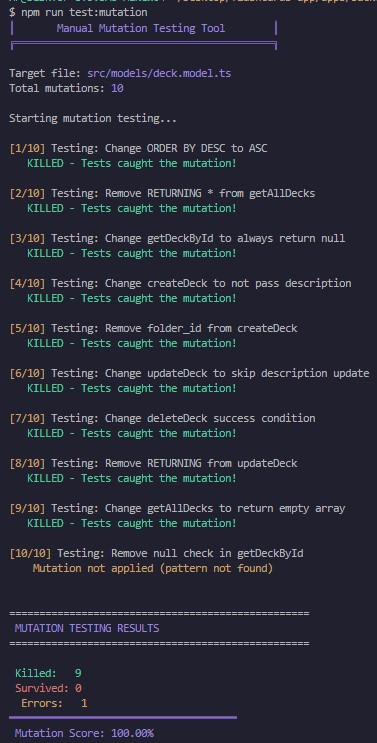

# Звіт про ефективність тестування Flashcards App

## Модульні (unit)

---

## Інтеграційні

---

## End-to-End (E2E)

---

## Мутаційне тестування

### Оцінка ефективності тестів

Тестами покрито всі основні бізнес-процеси системи: реєстрація, автентифікація, CRUD для папок, колод, карток, процес вивчення.

- Модульні тести ефективно перевіряють модель deck.model.ts (бізнес-логіка колод).

- Інтеграційні тести ефективно перевіряють зв’язки між модулями, сервером і базою даних.

- E2E сценарії повністю імітують дії реального користувача (автентифікація, створення папки, колоди, карток, вивченн карток).

- Мутаційне тестування показало, що було виявлено усі мутації.

---

### Що ще варто зробити

- Додати unit тести для інших моделей

- Розширити integration тести

- Додати performance тести

- Налаштувати автоматичний запуск тестів через GitHub Actions (CI/CD)

- Розширити E2E сценарії — додати тести з кількома користувачами й перевірку доступу до чужих даних

---

### Висновок

Тестування проєкту Flashcards App є ефективним і практично повним: воно охоплює основні елементи системи, виявляє більшість критичних помилок і гарантує стабільну роботу застосунку.
Подальші поліпшення мають на меті збільшення глибини перевірки та автоматизацію процесу тестування.
